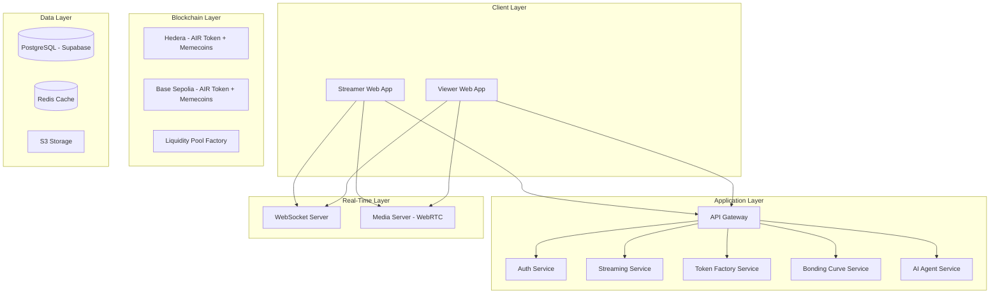

# air.fun MVP Design Document

## Overview

air.fun is a decentralized livestreaming platform that combines real-time video broadcasting with **pump.fun-style memecoin launches**. The platform enables streamers to monetize their content through automatic token creation and bonding curve pricing, where viewers purchase streamer memecoins by interacting with AI agents deployed as 3D AR objects during livestreams.

**Core Mechanism (Pump.fun Model):**

- Streamer creates stream → Platform auto-generates memecoin ($STREAMER_NAME)
- AI agents appear as clickable 3D AR buy buttons on viewer screens
- Viewers click agents → Buy memecoin with USDC via bonding curve pricing
- Streamer earns 98% of all trading fees instantly
- Token graduates at ~$69k market cap → Liquidity pool created (MEMECOIN/AIR pair)

The MVP architecture prioritizes:

- **Real-time performance**: Sub-3-second video latency
- **Simplified blockchain**: Hedera testnet + Base Sepolia (dual-chain deployment)
- **Creator economics**: 98% revenue share to streamers through bonding curve fees
- **Bonding curve pricing**: Automatic price discovery based on supply/demand
- **Token graduation**: Permanent liquidity pools when market cap reaches $69k
- **Scalability**: Support for 10 concurrent streams and 500 concurrent viewers

## Architecture

### High-Level System Architecture



TOKEN --> SC_H
TOKEN --> SC_B
CURVE --> DB
POOL --> SC_H
POOL --> SC_B
AUTH --> DB
STREAM --> DB
AGENT --> DB
STREAM --> REDIS
CURVE --> REDIS
STREAM --> S3

````

**Design Rationale**: Simplified architecture removes auction complexity (CRDT, cross-chain bridging). Token Factory creates memecoins on-demand. Bonding Curve Service handles all pricing calculations. WebSocket layer provides real-time price updates. Dual-chain deployment (Hedera + Base) for redundancy and ecosystem reach.

### Technology Stack

**Frontend**:
- React 18 with TypeScript for type safety
- WebRTC for peer-to-peer video streaming
- Three.js + @react-three/fiber for 3D AR agent rendering
- Socket.io client for real-time price updates
- Recharts for bonding curve visualization

**Backend**:
- Node.js with Express for API services
- Socket.io for WebSocket connections
- Supabase (PostgreSQL + real-time subscriptions)
- Redis for caching token prices and trade data

**Blockchain**:
- Hedera SDK for HTS token creation (AIR token + memecoins)
- Hedera Stablecoin Studio for USDC integration
- Ethers.js for Base Sepolia ERC-20 deployment
- Bonding curve smart contracts (quadratic pricing formula)
- Liquidity pool factory for token graduation

**Infrastructure**:
- Vercel for frontend hosting
- Supabase for backend + database
- AWS S3 for stream thumbnails and assets
- Hedera testnet + Base Sepolia testnet

**Design Rationale**: Simplified stack removes Solana, Ethereum mainnet, and CCIP bridge complexity. Hedera Stablecoin Studio provides easy USDC on-ramp. Bonding curve runs on-chain for trustless pricing. Dual deployment (Hedera + Base) provides redundancy without cross-chain bridging overhead.

## Components and Interfaces

### 1. Authentication Service

**Responsibilities**:
- Web3 wallet authentication (MetaMask, Phantom, Hashio)
- Email-based authentication for viewers
- Session management and JWT token generation
- Multi-wallet address management

**Key Interfaces**:
```typescript
interface AuthService {
  // Wallet authentication
  connectWallet(
    walletType: WalletType,
    signature: string
  ): Promise<AuthSession>;

  verifyWalletSignature(
    address: string,
    signature: string,
    message: string
  ): boolean;

  // Email authentication
  registerEmail(email: string, password: string): Promise<AuthSession>;
  loginEmail(email: string, password: string): Promise<AuthSession>;

  // Session management
  validateSession(token: string): Promise<User>;
  refreshSession(refreshToken: string): Promise<AuthSession>;

  // Multi-wallet support
  linkWallet(
    userId: string,
    walletAddress: string,
    chain: ChainType
  ): Promise<void>;

  getWalletBalances(userId: string): Promise<WalletBalance[]>;
}

interface AuthSession {
  accessToken: string;
  refreshToken: string;
  user: User;
  expiresAt: number;
}

type WalletType = "metamask" | "hashio";
type ChainType = "hedera" | "base";
````

**Design Rationale**: Simplified to two chains (Hedera + Base) removes Phantom/Solana/Ethereum complexity. Dual authentication (Web3 + email) lowers the barrier for viewers unfamiliar with crypto wallets while maintaining Web3-native experience for streamers.

### 2. Streaming Service

**Responsibilities**:

- Livestream lifecycle management (start, stop, status)
- WebRTC connection orchestration
- Video quality adaptation
- Stream discovery and filtering
- Thumbnail generation and storage

**Key Interfaces**:

```typescript
interface StreamingService {
  // Stream lifecycle
  startStream(streamerId: string, config: StreamConfig): Promise<Stream>;
  endStream(streamId: string): Promise<StreamSummary>;
  getStreamStatus(streamId: string): Promise<StreamStatus>;

  // Discovery
  listActiveStreams(filters: StreamFilters): Promise<Stream[]>;
  searchStreams(query: string): Promise<Stream[]>;
  getHotStreams(limit: number): Promise<Stream[]>;

  // WebRTC management
  createProducerTransport(streamId: string): Promise<TransportOptions>;
  createConsumerTransport(
    streamId: string,
    viewerId: string
  ): Promise<TransportOptions>;
  connectTransport(transportId: string, dtlsParameters: any): Promise<void>;
  produceMedia(
    transportId: string,
    kind: "audio" | "video",
    rtpParameters: any
  ): Promise<string>;
  consumeMedia(
    transportId: string,
    producerId: string
  ): Promise<ConsumerOptions>;
}

interface StreamConfig {
  title: string;
  category: string;
  quality: "720p" | "1080p";
  enableChat: boolean;
}

interface Stream {
  id: string;
  streamerId: string;
  streamerName: string;
  title: string;
  category: string;
  thumbnailUrl: string;
  viewerCount: number;
  tokenSymbol?: string; // e.g., "$KIRO"
  tokenMarketCap?: number;
  startedAt: number;
  status: "live" | "ended";
}

interface StreamSummary {
  totalViewers: number;
  peakViewers: number;
  totalEarnings: number;
  totalTokensSold: number;
  duration: number;
  topBuyers: Buyer[];
}

interface Buyer {
  userId: string;
  username: string;
  totalPurchased: number;
  totalSpent: number;
}
```

**Design Rationale**: WebRTC with SFU (Selective Forwarding Unit) architecture via Mediasoup enables efficient one-to-many streaming. The service abstracts WebRTC complexity from clients while providing granular control over transport and media production/consumption.

### 3. AI Agent Service

**Responsibilities**:

- Agent template management (buy buttons, challenge givers, leaderboards)
- Agent deployment in 3D space during streams
- Agent click tracking and purchase attribution
- AR gamification logic (challenges, predictions)
- Agent state persistence

**Key Interfaces**:

```typescript
interface AIAgentService {
  // Template management
  listAgentTemplates(): Promise<AgentTemplate[]>;
  getAgentTemplate(templateId: string): Promise<AgentTemplate>;

  // Deployment
  deployAgent(streamId: string, config: AgentConfig): Promise<DeployedAgent>;
  updateAgentPosition(
    agentId: string,
    position: [number, number, number]
  ): Promise<void>;
  removeAgent(agentId: string): Promise<void>;

  // Purchase Attribution
  trackAgentClick(agentId: string, userId: string): Promise<void>;
  recordPurchase(agentId: string, purchaseId: string): Promise<void>;

  // Gamification
  createChallenge(
    agentId: string,
    challenge: ChallengeConfig
  ): Promise<Challenge>;
  updateChallengeProgress(challengeId: string, progress: number): Promise<void>;
  getAgentStats(agentId: string): Promise<AgentStats>;
}

interface AgentTemplate {
  id: string;
  name: string;
  description: string;
  type: "buy_button" | "challenge_giver" | "predictor" | "leaderboard";
  modelUrl: string;
  defaultColor: string;
}

interface AgentConfig {
  name: string;
  templateId: string;
  position: [number, number, number];
  defaultPurchaseAmount: number; // Default tokens to buy on click
  quickBuyEnabled: boolean; // One-click purchase
  challenge?: ChallengeConfig;
}

interface DeployedAgent {
  id: string;
  streamId: string;
  templateId: string;
  position: [number, number, number];
  status: "active" | "paused";
  totalClicks: number;
  totalPurchases: number;
  totalVolume: number; // USDC transacted through this agent
  deployedAt: number;
}

interface AgentStats {
  totalClicks: number;
  totalPurchases: number;
  totalVolume: number;
  conversionRate: number; // purchases / clicks
  averagePurchaseSize: number;
}

interface ChallengeConfig {
  type: "click_count" | "purchase_target" | "prediction";
  goal: number;
  reward: number; // Bonus tokens
  timeLimit?: number; // seconds
}
```

**Design Rationale**: Agents are simplified to AR buy buttons with optional gamification. Removed complex auction logic. Focus on click tracking, purchase attribution, and challenge mechanics for engagement.

### 4. Token Factory Service

**Responsibilities**:

- Automatic memecoin creation when stream starts
- Token deployment on Hedera (HTS) and Base (ERC-20)
- Ticker symbol generation
- Token metadata management
- Contract address tracking

**Key Interfaces**:

```typescript
interface TokenFactoryService {
  // Token Creation
  createMemecoin(
    streamerId: string,
    streamerName: string,
    chain: ChainType
  ): Promise<Memecoin>;

  // Token Management
  getMemecoin(tokenId: string): Promise<Memecoin>;
  getMemecoinByStream(streamId: string): Promise<Memecoin>;
  updateTokenMetadata(tokenId: string, metadata: TokenMetadata): Promise<void>;

  // Graduation
  graduateToken(tokenId: string): Promise<LiquidityPool>;
  checkGraduationEligibility(tokenId: string): Promise<boolean>;
}

interface Memecoin {
  id: string;
  streamId: string;
  streamerId: string;

  // Token Details
  name: string; // e.g., "Streamer John Coin"
  symbol: string; // e.g., "JOHN420"
  totalSupply: number; // 1 billion
  bondingCurveSupply: number; // 800 million on curve

  // State
  currentPrice: number; // USDC per token
  marketCap: number;
  liquidityRaised: number; // USDC in bonding curve
  tokensSold: number;

  // Graduation
  graduationTarget: number; // $69,000
  isGraduated: boolean;
  liquidityPoolAddress?: string;

  // Blockchain
  contractAddress: string;
  chain: ChainType;
  createdAt: Date;
}

interface TokenMetadata {
  logoUrl?: string;
  description?: string;
  socialLinks?: {
    twitter?: string;
    telegram?: string;
  };
}

interface LiquidityPool {
  id: string;
  tokenId: string;
  pairAddress: string; // MEMECOIN/AIR pool
  liquidity: number; // Total value locked
  lpTokensBurned: boolean; // Rug pull protection
  createdAt: Date;
}

type ChainType = "hedera" | "base";
```

**Design Rationale**: Automated token creation removes streamer friction. Symbol generation ensures uniqueness. Dual-chain deployment (Hedera + Base) provides ecosystem reach. Graduation creates permanent liquidity pools preventing rug pulls.

### 5. Bonding Curve Service

**Responsibilities**:

- Calculate token prices based on bonding curve formula
- Process token purchases with automatic pricing
- Track trading volume and liquidity
- Determine graduation eligibility
- Fee distribution (98% creator, 2% platform)

**Key Interfaces**:

```typescript
interface BondingCurveService {
  // Price Calculation
  calculatePrice(tokensSold: number): number;
  getPriceQuote(tokenId: string, amount: number): PriceQuote;
  calculatePurchaseCost(currentSupply: number, tokensToBuy: number): number;

  // Purchase Processing
  executePurchase(purchase: PurchaseRequest): Promise<Purchase>;
  validatePurchase(
    tokenId: string,
    amount: number,
    userId: string
  ): ValidationResult;

  // Liquidity Management
  getLiquidityDepth(tokenId: string): Promise<number>;
  calculateGraduationProgress(tokenId: string): Promise<number>;

  // Fee Distribution
  distributeFees(purchaseId: string): Promise<FeeDistribution>;
}

interface PriceQuote {
  tokenAmount: number;
  usdcCost: number;
  pricePerToken: number;
  priceImpact: number; // % change
  slippage: number; // 0.5% default
  estimatedGas: number;
}

interface PurchaseRequest {
  tokenId: string;
  buyerId: string;
  amount: number; // Tokens to buy
  maxSlippage: number; // e.g., 0.5 for 0.5%
  chain: ChainType;
}

interface Purchase {
  id: string;
  tokenId: string;
  buyerId: string;
  amount: number; // Tokens purchased
  price: number; // USDC per token at time of purchase
  totalSpent: number; // Total USDC spent
  fees: {
    creatorFee: number; // 98%
    platformFee: number; // 2%
  };
  txHash: string;
  timestamp: Date;
}

interface FeeDistribution {
  purchaseId: string;
  creatorAmount: number; // 98% of total
  platformAmount: number; // 2% of total
  creatorTxHash: string;
  platformTxHash: string;
}

interface BondingCurveState {
  currentPrice: number;
  nextPrice: number; // If someone buys 1000 tokens
  marketCap: number;
  liquidityDepth: number;
  tokensRemaining: number; // Until graduation
  graduationProgress: number; // 0-100%
}

// Bonding Curve Formula: price = k * tokensSold^2
const BONDING_CURVE_K = 0.000000001;
const GRADUATION_MARKET_CAP = 69000; // $69k in USDC
```

**Design Rationale**: Quadratic bonding curve (price = k \* sold²) ensures early buyers get lower prices. Automatic price discovery eliminates auction complexity. 98/2 fee split maximizes creator revenue while sustaining platform. Real-time price quotes prevent front-running.

### 6. Smart Contract Service

**Responsibilities**:

- Deploy AIR platform token on Hedera + Base
- Deploy memecoin contracts via token factory
- Execute bonding curve purchases
- Create liquidity pools on graduation
- Transaction monitoring and confirmation

**Key Interfaces**:

```typescript
interface SmartContractService {
  // Token Deployment
  deployAIRToken(chain: ChainType): Promise<string>; // Returns contract address
  deployMemecoin(
    name: string,
    symbol: string,
    chain: ChainType
  ): Promise<string>;

  // Purchase Execution
  executeBondingCurvePurchase(purchase: PurchaseRequest): Promise<string>; // Returns txHash

  // Liquidity Pool Creation
  createLiquidityPool(
    tokenAddress: string,
    airTokenAddress: string
  ): Promise<string>;
  burnLPTokens(poolAddress: string): Promise<string>;

  // Fee Distribution
  transferCreatorFees(
    streamerAddress: string,
    amount: number,
    chain: ChainType
  ): Promise<string>;
  transferPlatformFees(amount: number, chain: ChainType): Promise<string>;

  // Monitoring
  waitForConfirmation(
    txHash: string,
    chain: ChainType
  ): Promise<TransactionReceipt>;
  getTransactionStatus(txHash: string, chain: ChainType): Promise<TxStatus>;

  // Contract Events
  subscribeToContractEvents(
    chain: ChainType,
    eventType: ContractEvent,
    callback: (event: any) => void
  ): Subscription;
}

interface TransactionReceipt {
  txHash: string;
  blockNumber: number;
  status: "success" | "failed";
  gasUsed: number;
}

type ContractEvent =
  | "TokenPurchased"
  | "TokenGraduated"
  | "LiquidityPoolCreated"
  | "FeesDistributed";

type TxStatus = "pending" | "confirmed" | "failed";
```

**Design Rationale**: Simplified to two chains (Hedera + Base) removes cross-chain complexity. Bonding curve logic runs on-chain for trustless pricing. Automatic liquidity pool creation with LP token burning prevents rug pulls.

### 7. Real-Time Communication Service

**Responsibilities**:

- WebSocket connection management
- Live chat message broadcasting
- Purchase notification distribution
- Token price update broadcasting
- Connection recovery and reconnection

**Key Interfaces**:

```typescript
interface RealtimeService {
  // Connection management
  handleConnection(socket: Socket, userId: string): void;
  handleDisconnection(socket: Socket): void;

  // Room management
  joinStreamRoom(socket: Socket, streamId: string): void;
  leaveStreamRoom(socket: Socket, streamId: string): void;

  // Message broadcasting
  broadcastChatMessage(streamId: string, message: ChatMessage): void;
  broadcastPurchaseNotification(streamId: string, purchase: Purchase): void;
  broadcastPriceUpdate(streamId: string, priceState: BondingCurveState): void;
  broadcastGraduationAnnouncement(
    streamId: string,
    graduation: GraduationNotification
  ): void;

  // Recovery
  reconnectClient(socket: Socket, lastEventId: string): void;
}

interface ChatMessage {
  id: string;
  streamId: string;
  userId: string;
  username: string;
  message: string;
  timestamp: number;
  mentions: string[];
}

interface PurchaseNotification {
  tokenId: string;
  buyerId: string;
  buyerUsername: string;
  amount: number;
  price: number;
  newMarketCap: number;
}

interface GraduationNotification {
  tokenId: string;
  tokenSymbol: string;
  finalMarketCap: number;
  liquidityPoolAddress: string;
}
```

**Design Rationale**: Socket.io provides reliable WebSocket connections with automatic fallback to long-polling. Room-based broadcasting ensures efficient message distribution to relevant clients. Price updates broadcast at 100ms intervals ensure real-time bonding curve visualization without overwhelming clients.

## Data Models

### User Model

```typescript
interface User {
  id: string;
  role: "streamer" | "viewer";
  email?: string;
  username: string;
  avatarUrl?: string;
  createdAt: number;

  // Streamer-specific
  profileCategory?: string;
  walletAddresses?: WalletAddress[];
  totalTokensCreated?: number;
  totalEarnings?: number;

  // Viewer-specific
  totalSpent?: number;
  totalTokensBought?: number;
  favoriteStreamers?: string[];
  achievements?: Achievement[];
  agentClickCount?: number; // Gamification tracking
}

interface WalletAddress {
  chain: ChainType;
  address: string;
  isPrimary: boolean;
  verified: boolean;
}

interface Achievement {
  id: string;
  name: string;
  description: string;
  unlockedAt: number;
}
```

### Stream Model

```typescript
interface StreamRecord {
  id: string;
  streamerId: string;
  title: string;
  category: string;
  thumbnailUrl: string;
  startedAt: number;
  endedAt?: number;
  status: "live" | "ended";

  // Associated Token
  tokenId?: string;
  tokenSymbol?: string;
  tokenMarketCap?: number;

  // Metrics
  peakViewerCount: number;
  totalViewers: number;
  totalTokensSold: number;
  totalVolume: number;
  totalEarnings: number;
  agentClickCount: number;

  // Configuration
  quality: "720p" | "1080p";
  enableChat: boolean;
}
```

### Memecoin Model

```typescript
interface Memecoin {
  id: string;
  streamId: string;
  streamerId: string;
  symbol: string; // e.g., "$KIRO"
  name: string; // e.g., "Kiro Coin"
  chain: ChainType;
  contractAddress: string;
  createdAt: number;

  // Bonding Curve State
  totalSupply: number;
  tokensSold: number;
  currentPrice: number;
  marketCap: number;

  // Graduation
  hasGraduated: boolean;
  graduatedAt?: number;
  liquidityPoolAddress?: string;

  // Metrics
  holderCount: number;
  transactionCount: number;
  totalVolume: number;
  creatorEarnings: number;
}

interface BondingCurveState {
  tokenId: string;
  k: number; // Bonding curve constant
  tokensSold: number;
  currentPrice: number;
  marketCap: number;
  nextPrice: number; // For UI preview
  graduationThreshold: number; // $69,000
  progressToGraduation: number; // 0-1
  updatedAt: number;
}

interface Purchase {
  id: string;
  tokenId: string;
  buyerId: string;
  chain: ChainType;

  // Purchase Details
  tokenAmount: number;
  pricePerToken: number;
  totalCost: number;
  transactionHash: string;

  // Fee Distribution
  creatorFee: number; // 98%
  platformFee: number; // 2%

  timestamp: number;
}

interface LiquidityPool {
  id: string;
  tokenId: string;
  chain: ChainType;
  poolAddress: string;
  tokenReserve: number;
  airReserve: number; // Paired with AIR platform token
  lpTokensBurned: boolean;
  createdAt: number;
}
```

### Agent Model

```typescript
interface AgentRecord {
  id: string;
  streamerId: string;
  templateId: string;
  name: string;
  config: AgentConfig;

  // Gamification
  totalClicks: number;
  totalPurchasesGenerated: number;
  totalVolumeGenerated: number;

  createdAt: number;
  updatedAt: number;
}

interface AgentDeploymentRecord {
  id: string;
  agentId: string;
  streamId: string;
  deployedAt: number;
  removedAt?: number;
  status: "active" | "paused" | "removed";

  // Performance metrics
  totalClicks: number;
  totalPurchases: number;
  totalVolume: number;
  conversionRate: number; // clicks → purchases
}
```

**Design Rationale**: Normalized relational schema with clear foreign key relationships enables efficient querying and analytics. Denormalized metrics (totalTokensSold, totalVolume) on Stream and Agent models optimize dashboard queries. Blockchain transaction hashes provide audit trail and transparency. Bonding curve state cached in Redis for real-time price updates.

## Error Handling

### Error Categories

1. **Authentication Errors**

   - Invalid wallet signature
   - Expired session token
   - Insufficient permissions

2. **Validation Errors**

   - Purchase amount below minimum (e.g., < $1)
   - Insufficient wallet balance
   - Invalid token configuration (supply, symbol)

3. **Network Errors**

   - WebRTC connection failure
   - WebSocket disconnection
   - Blockchain RPC timeout

4. **Smart Contract Errors**

   - Transaction revert
   - Insufficient gas
   - Token graduation failed (LP creation)

5. **Bonding Curve Errors**
   - Price slippage exceeded
   - Market cap calculation error
   - Token already graduated

### Error Handling Strategy

```typescript
interface ErrorResponse {
  code: string;
  message: string;
  details?: any;
  retryable: boolean;
  suggestedAction?: string;
}

// Example error codes
const ErrorCodes = {
  // Authentication
  AUTH_INVALID_SIGNATURE: "AUTH_001",
  AUTH_SESSION_EXPIRED: "AUTH_002",

  // Validation
  PURCHASE_BELOW_MINIMUM: "PURCHASE_001",
  PURCHASE_SLIPPAGE_EXCEEDED: "PURCHASE_002",
  TOKEN_INVALID_SYMBOL: "TOKEN_001",
  TOKEN_ALREADY_GRADUATED: "TOKEN_002",

  // Network
  WEBRTC_CONNECTION_FAILED: "NET_001",
  WEBSOCKET_DISCONNECTED: "NET_002",
  BLOCKCHAIN_TIMEOUT: "NET_003",

  // Smart Contract
  TX_REVERTED: "SC_001",
  INSUFFICIENT_GAS: "SC_002",
  INSUFFICIENT_BALANCE: "SC_003",

  // Bonding Curve
  CURVE_CALCULATION_ERROR: "CURVE_001",
  GRADUATION_FAILED: "CURVE_002",
};
```

### Recovery Mechanisms

**WebRTC Connection Recovery**:

- Automatic reconnection attempts for up to 30 seconds
- Exponential backoff: 1s, 2s, 4s, 8s, 15s
- Fallback to stream reload if reconnection fails

**WebSocket Recovery**:

- Socket.io automatic reconnection with event replay
- Client sends last received event ID on reconnect
- Server replays missed events from event log

**Smart Contract Transaction Recovery**:

- Transaction status polling every 5 seconds for up to 60 seconds
- Purchase retry with updated price if transaction times out
- User notification with blockchain explorer link

**Bonding Curve State Recovery**:

- Redis cache miss → Recalculate from blockchain token state
- Periodic price synchronization every 10 seconds
- Recovery mechanisms follow blockchain as source of truth

**Design Rationale**: Explicit error codes enable client-side error handling logic and user-friendly messaging. Retryable flag guides automatic retry behavior. Recovery mechanisms prioritize user experience while maintaining data consistency through blockchain as source of truth for token state.

## Correctness Properties

_A property is a characteristic or behavior that should hold true across all valid executions of a system-essentially, a formal statement about what the system should do. Properties serve as the bridge between human-readable specifications and machine-verifiable correctness guarantees._

### Property 1: Bonding Curve Price Monotonicity

_For any_ token, if tokens are purchased increasing the supply from S1 to S2 where S2 > S1, then the price at S2 must be greater than or equal to the price at S1.
**Validates: Requirements 10 (bonding curve pricing)**

### Property 2: Fee Distribution Correctness

_For any_ token purchase, the sum of creator fee (98%) and platform fee (2%) must equal exactly 100% of the purchase amount.
**Validates: Requirements 10.2, 10.3 (payment distribution)**

### Property 3: Token Supply Conservation

_For any_ memecoin, the total supply must remain constant at 1 billion tokens, and tokensSold must never exceed totalSupply.
**Validates: Requirements 10 (token creation)**

### Property 4: Graduation Threshold Consistency

_For any_ token, graduation should occur if and only if the market cap reaches or exceeds $69,000.
**Validates: Requirements 10 (token graduation)**

### Property 5: Authentication Session Validity

_For any_ valid JWT token, the token must be verifiable and the expiration time must be in the future.
**Validates: Requirements 1.2, 2.3 (session management)**

### Property 6: WebRTC Connection Idempotency

_For any_ stream, creating multiple consumer transports for the same viewer should not create duplicate connections.
**Validates: Requirements 4.3, 13 (WebRTC management)**

### Property 7: Price Quote Accuracy

_For any_ token purchase request, the actual execution price must be within the specified slippage tolerance of the quoted price.
**Validates: Requirements 8.4 (bid validation), 9 (price synchronization)**

### Property 8: Agent Click Attribution

_For any_ purchase made through an agent, the purchase must be correctly attributed to that agent's statistics.
**Validates: Requirements 6 (agent deployment)**

### Property 9: Chat Message Ordering

_For any_ stream, chat messages must be delivered to all viewers in the same order they were sent (FIFO).
**Validates: Requirements 12.1, 12.2 (chat functionality)**

### Property 10: Liquidity Pool Immutability

_For any_ graduated token, once the liquidity pool is created and LP tokens are burned, the pool address must remain unchanged.
**Validates: Requirements 10 (token graduation)**

### Property 11: Wallet Balance Consistency

_For any_ user with multiple wallet addresses, the sum of balances across all chains must match the total balance displayed.
**Validates: Requirements 1.3 (multi-wallet support)**

### Property 12: Stream Lifecycle State Machine

_For any_ stream, valid state transitions are: null → "live" → "ended", and no other transitions are permitted.
**Validates: Requirements 3.1, 3.3 (stream lifecycle)**

### Property 13: Purchase Transaction Atomicity

_For any_ token purchase, either all operations (lock funds, update supply, distribute fees) succeed together, or all fail together.
**Validates: Requirements 8, 10 (purchase processing)**

### Property 14: Real-time Price Update Freshness

_For any_ active stream, price updates broadcast to viewers must reflect token state changes within 500ms.
**Validates: Requirements 9.1, 19.2 (real-time synchronization)**

### Property 15: Agent Template Immutability

_For any_ agent template, the template properties (type, modelUrl, defaultColor) must remain constant after creation.
**Validates: Requirements 17 (agent template management)**

## Testing Strategy

### Unit Testing

**Scope**: Individual functions and components in isolation

**Coverage Targets**:

- Service layer: 80% code coverage
- Smart contracts: 100% code coverage
- Utility functions: 90% code coverage

**Key Test Areas**:

- Token symbol validation (3-5 characters, unique)
- Bonding curve price calculation (price = k \* sold²)
- Fee distribution (98% creator, 2% platform)
- Graduation threshold logic ($69k market cap)
- Wallet signature verification

**Tools**: Jest, Mocha, Hardhat (smart contracts)

### Property-Based Testing

**Scope**: Universal properties that should hold across all inputs

**Property Testing Requirements**:

- Use fast-check library for JavaScript/TypeScript property-based testing
- Configure each property test to run minimum 100 iterations
- Tag each property test with comment referencing design document property
- Format: `// Feature: air-fun-mvp, Property 1: Bonding Curve Price Monotonicity`
- Each correctness property must be implemented by a single property-based test

**Key Property Tests**:

- Property 1: Bonding curve monotonicity across random token supplies
- Property 2: Fee distribution correctness for random purchase amounts
- Property 3: Token supply conservation after random purchase sequences
- Property 7: Price quote accuracy within slippage for random amounts
- Property 13: Purchase atomicity under random failure scenarios

### Integration Testing

**Scope**: Service interactions and API endpoints

**Key Test Scenarios**:

- End-to-end stream lifecycle (start → create token → buy tokens → graduate → LP creation)
- Multi-chain token deployment (Hedera + Base)
- Token purchase flow (calculate price → execute purchase → distribute fees)
- WebSocket price broadcasting
- Real-time bonding curve state updates

**Tools**: Supertest, Testcontainers (PostgreSQL, Redis)

### End-to-End Testing

**Scope**: Full user workflows through UI

**Key User Flows**:

- Streamer: Authenticate → Start stream → Monitor token sales → Claim earnings
- Viewer: Authenticate → Browse streams → Watch stream → Click AI agent → Buy tokens → Track portfolio

**Tools**: Playwright, Cypress

### Performance Testing

**Scope**: System behavior under load

**Test Scenarios**:

- 10 concurrent streams with 50 viewers each (500 total)
- 100 token purchases per minute across all streams
- Video streaming latency measurement
- Price update latency measurement

**Acceptance Criteria**:

- Video latency < 3 seconds
- Price update latency < 500ms
- Bonding curve calculation < 100ms
- API response time p95 < 500ms

**Tools**: k6, Artillery

### Smart Contract Testing

**Scope**: Contract logic and security

**Test Areas**:

- Token creation and validation logic
- Bonding curve purchase execution
- Fee distribution calculations (98/2 split)
- Access control and authorization
- Reentrancy protection
- Gas optimization

**Tools**: Hardhat, Foundry, Slither (security analysis)

**Design Rationale**: Testing strategy prioritizes smart contract correctness (100% coverage) due to immutability and financial risk. Property-based testing validates universal correctness properties across all inputs. Performance testing validates real-time requirements (sub-3s video, sub-500ms price updates). E2E tests ensure critical user flows work across the full stack.

## Security Considerations

### Authentication Security

- Wallet signature verification using EIP-191 standard
- JWT tokens with 1-hour expiration and refresh token rotation
- Rate limiting: 10 authentication attempts per IP per minute
- Session invalidation on wallet disconnection

### Smart Contract Security

- Reentrancy guards on all state-changing functions
- Access control via OpenZeppelin's Ownable and AccessControl
- Pausable contracts for emergency stops
- Time-lock on critical parameter changes (bonding curve constant k)
- Multi-signature requirement for fund withdrawals

### API Security

- CORS whitelist for authorized domains
- Rate limiting: 100 requests per minute per user
- Input validation and sanitization
- SQL injection prevention via parameterized queries
- XSS protection via Content Security Policy headers

### Data Security

- Encryption in transit: TLS 1.3 for all connections
- Encryption at rest: AES-256 for sensitive data
- Wallet addresses hashed in logs
- PII redaction in error messages
- Secure key management via AWS Secrets Manager

### Bonding Curve Security

- Price slippage protection (max 5% deviation)
- Purchase amount validation before smart contract interaction
- Double-spend prevention via nonce tracking
- Graduated token verification before LP creation
- Fee distribution validation (98% + 2% = 100%)

**Design Rationale**: Security-first approach protects user funds and data. Smart contract security is paramount given immutability. Rate limiting prevents abuse and DoS attacks. Encryption standards follow industry best practices. Bonding curve security ensures fair pricing and prevents manipulation.

## Deployment Architecture

### Infrastructure Components

**Application Tier**:

- 3x EC2 t3.large instances (API + WebSocket servers)
- Auto-scaling group with target tracking (CPU > 70%)
- Application Load Balancer with health checks

**Media Tier**:

- 2x EC2 c5.medium instances (WebRTC servers - no SFU)
- Dedicated instances for WebRTC processing
- Sticky sessions for WebRTC connection persistence

**Database Tier**:

- RDS PostgreSQL 14 (db.t3.medium)
- Multi-AZ deployment for high availability
- Automated backups with 7-day retention

**Cache Tier**:

- ElastiCache Redis 6 (cache.t3.medium)
- Cluster mode for horizontal scaling
- Pub/sub for WebSocket message distribution
- Bonding curve price caching

**Storage Tier**:

- S3 bucket for stream thumbnails and assets
- CloudFront CDN for global content delivery
- Lifecycle policy: delete thumbnails after 30 days

### Deployment Pipeline

1. **Build**: Docker image creation with multi-stage builds
2. **Test**: Automated test suite execution (unit + integration)
3. **Security Scan**: Container vulnerability scanning
4. **Deploy**: Blue-green deployment to minimize downtime
5. **Smoke Test**: Health check validation
6. **Traffic Shift**: Gradual traffic migration (10% → 50% → 100%)

### Monitoring and Observability

**Metrics**:

- Application: Request rate, error rate, latency (p50, p95, p99)
- WebRTC: Connection success rate, packet loss, jitter
- Blockchain: Transaction confirmation time, gas costs
- Business: Active streams, concurrent viewers, token purchase volume, graduation rate

**Logging**:

- Structured JSON logs with correlation IDs
- Centralized logging via CloudWatch Logs
- Log retention: 30 days

**Alerting**:

- PagerDuty integration for critical alerts
- Alert conditions: Error rate > 5%, latency p95 > 1s, stream failure

**Tools**: Prometheus, Grafana, CloudWatch, Sentry

**Design Rationale**: Multi-tier architecture enables independent scaling of compute-intensive components (WebRTC media servers). Blue-green deployment minimizes user impact during releases. Comprehensive monitoring ensures SLA compliance and rapid incident response.

## MVP Scope and Future Enhancements

### MVP Includes

- Web3 wallet authentication (MetaMask, Hashio)
- Email authentication for viewers
- WebRTC livestreaming (720p, 1080p)
- 4 pre-built AI agent templates (buy buttons, challenges, predictions, leaderboards)
- Auto memecoin creation on stream start
- Bonding curve token buying
- Token graduation at $69k market cap
- Dual-chain support (Hedera testnet, Base Sepolia)
- Live chat with emotes
- Real-time bonding curve visualization
- Basic analytics dashboard
- 10 concurrent streams, 500 concurrent viewers

### MVP Excludes (Future Enhancements)

- Mobile native apps (iOS, Android)
- Advanced AI agent customization (LLM-powered interactions)
- Multiple tokens per stream
- NFT-gated streams
- Video recording and VOD playback
- Advanced analytics (holder tracking, whale alerts)
- Streamer collaboration (co-streaming)
- Governance token for platform decisions
- Cross-chain bridging (unified multi-chain liquidity)

**Design Rationale**: MVP focuses on core value proposition (livestreaming + pump.fun memecoin model) with essential features for both streamers and viewers. Bonding curve simplifies pricing and removes complex auction logic. Future enhancements address customization, multi-chain liquidity, and advanced gamification once product-market fit is validated.
